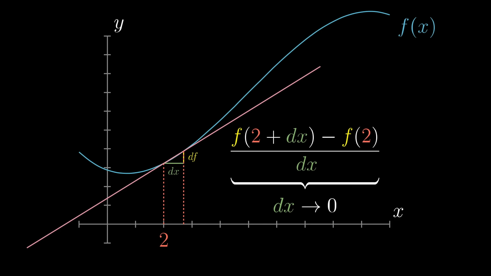

# Intuition Notebook

[Back to TOC](../README.md)

> **What this is:** A running collection of deep intuitions — the "aha" moments and mental models that make concepts click. Unlike the cheat sheet (formulas and facts), this notebook captures the *why* behind things. Add to it whenever something crystallizes.

> **📌 Maintenance rule:** When adding a new intuition entry, also add a matching link in the Table of Contents below, under the appropriate section. Keep the TOC in sync with the content.

---

## 📑 Table of Contents

### [Linear Algebra](#linear-algebra)
- [Matrix × Vector: Two Complementary Views](#matrix--vector-two-complementary-views)
- [SVD means every matrix is rotate → scale → rotate](#svd-means-every-matrix-is-rotate--scale--rotate)
- [Eigenvectors are the directions that "survive" a transformation](#eigenvectors-are-the-directions-that-survive-a-transformation)
- [Why symmetric matrices have orthogonal eigenvectors (via SVD)](#why-symmetric-matrices-have-orthogonal-eigenvectors-via-svd)
- [PCA's eigenvectors are just SVD's right singular vectors](#pcas-eigenvectors-are-just-svds-right-singular-vectors--and-symmetry-is-why)
- [PCA is a change of basis that diagonalizes the covariance matrix](#pca-is-a-change-of-basis-that-diagonalizes-the-covariance-matrix)
- [Matrix type taxonomy](#matrix-type-taxonomy-what-each-type-does-to-space)
- [Every linear transformation maps the unit square to a parallelogram](#every-linear-transformation-maps-the-unit-square-to-a-parallelogram)
- [Null space lives in the INPUT space](#null-space-lives-in-the-input-space-not-the-output-space)
- [Miscellaneous Thoughts](#miscellaneous-thoughts)

### [Calculus & Optimization](#calculus--optimization)
- [The derivative is literally rise/run](#the-derivative-is-literally-riserun--just-infinitely-zoomed-in)
- [Geometric understanding of derivatives, product rule, chain rule](#geometric-understanding-of-derivatives-the-product-rule-and-the-chain-rule)
- [The gradient is perpendicular to contour lines](#the-gradient-is-perpendicular-to-contour-lines-and-points-uphill)

### [Statistics & Regression](#statistics--regression)

### [ML & Neural Networks](#ml--neural-networks)

### [Interpretability](#interpretability)

### [Alignment](#alignment)

### [Vocabulary: Commonly Confused Terms](#vocabulary-commonly-confused-terms)

### [Calculus Intuitions](#calculus-intuitions)
- [Riemann Sums — What they really are](#riemann-sums--what-they-really-are)
- [Trig Sub — Converting back from double angles](#trig-sub--converting-back-from-double-angles)
- [The Gaussian Integral and the Standard Normal — Why √(2π) and not √π](#the-gaussian-integral-and-the-standard-normal--why-2π-and-not-π)

---

## Linear Algebra

### Matrix × Vector: Two Complementary Views

**Column View (Linear Combination):**
The columns of the matrix are your new basis vectors. The entries of your input vector are *weights* — they tell you how much of each column/basis vector to combine. The first entry scales the first column, the second entry scales the second column, and you add them all up.

**Row View (Dot Product / Measurement):**
The rows of the matrix are vectors living in the same space as your input. To get each output entry, you take the dot product of that row with your input vector. The dot product captures both *directional alignment* (how much they point the same way) and *magnitude* (how large both vectors are). It's not just a "shadow" — a pure shadow would ignore the row's length. The dot product only becomes pure alignment when the row is a unit vector, which is why normalization shows up everywhere in ML.

**Why both are true simultaneously:**
These aren't different operations — they're two lenses on the exact same arithmetic. The column view asks "what am I building?" The row view asks "what am I measuring?" In ML, each row acts as a feature detector — asking "how much does this input match my pattern?"

### SVD means every matrix is rotate → scale → rotate
No matter how complicated a matrix looks, it's doing three simple things in sequence. Vᵀ aligns the input with natural axes, Σ stretches along those axes, U rotates the output. The singular values tell you HOW MUCH stretching happens in each direction. If some singular values are zero, dimensions get crushed — that's rank deficiency.

### Eigenvectors are the directions that "survive" a transformation
Most vectors get both stretched AND rotated by a matrix. Eigenvectors ONLY get stretched (by λ) — they stay on their line. They're the "natural axes" of the transformation. This is why PCA works: the eigenvectors of the covariance matrix ARE the directions of maximum variance. A generic vector like [1, 0] that isn't an eigenvector will end up pointing in a new direction after the transformation — it gets warped in both magnitude and direction.

### Why symmetric matrices have orthogonal eigenvectors (via SVD)
Start with any symmetric matrix A (so Aᵀ = A) and its SVD: A = UΣVᵀ. Take the transpose of both sides: Aᵀ = VΣUᵀ. But A = Aᵀ, so UΣVᵀ = VΣUᵀ — which forces U = V (up to sign flips on columns to handle negative eigenvalues). So the SVD collapses to A = VΣVᵀ. Since V is orthogonal (Vᵀ = V⁻¹), this is A = VΣV⁻¹ — which is exactly the eigendecomposition PDP⁻¹. The columns of V are simultaneously the right singular vectors and the eigenvectors, and they're orthogonal because SVD's V is always orthogonal. Symmetry forces the input and output rotations to be the same, which turns SVD into eigendecomposition with orthogonality guaranteed for free.

**Consequence — symmetric can't rotate:** Since U = V, the SVD is VΣVᵀ: rotate into eigenbasis (Vᵀ), scale (Σ), rotate back by the exact same amount (V). Steps 1 and 3 cancel → pure stretch, zero net rotation. For a general matrix, U ≠ V and the mismatch between input and output rotations is where rotation comes from.

**Non-uniform scaling looks like rotation on individual vectors:** A symmetric matrix like [[1,-1],[-1,1]] maps [1,0] → [1,-1] — the vector changed direction! But it's not rotation. The vector's eigenvector components got scaled by different amounts (one crushed to 0, the other doubled), warping its direction as a side effect. The test: rotation preserves the unit circle. Symmetric matrices send it to an ellipse. That's scaling, not rotation.

### PCA's eigenvectors are just SVD's right singular vectors — and symmetry is why
We have our covariance matrix C = (1/n)XᵀX, and we were going to take its eigenvectors. But if we take X = UΣVᵀ and expand XᵀX, we get (UΣVᵀ)ᵀ(UΣVᵀ) = VΣᵀUᵀUΣVᵀ = VΣ²Vᵀ (since UᵀU = I). So the eigenvectors of XᵀX are just V — the right singular vectors of X — and the eigenvalues are Σ².

The deeper reason this works so cleanly: AᵀA is always symmetric, which means its eigenvectors are orthogonal. In the eigenbasis, it's pure scaling — no rotation. So when SVD decomposes X into rotate → scale → rotate, the two rotations in AᵀA must cancel each other out, leaving only the scaling (Σ²) expressed in the V basis.

In practice, real algorithms compute SVD directly on X using iterative methods (never forming XᵀX), which avoids squaring the condition number. But for hand computation, eigendecomposing XᵀX is the right approach.

### PCA is a change of basis that diagonalizes the covariance matrix
The old coordinates are whatever basis your data was originally measured in (e.g., the neuron basis for transformer activations — each coordinate = one neuron's firing). In this basis, dimensions are typically correlated: the covariance matrix has non-zero off-diagonal entries. PCA computes the eigenvectors of the covariance matrix and uses them as a new basis. Since the covariance matrix is symmetric, these eigenvectors are orthogonal, so P is an orthogonal matrix and the change of basis is just x_new = Pᵀx. In this new coordinate system, the covariance matrix becomes diagonal (D = P⁻¹AP) — meaning every dimension is uncorrelated. Each principal component captures its own independent chunk of variance, with the eigenvalues on the diagonal telling you how much. Largest eigenvalue = direction of maximum spread. The data's structure is maximally "disentangled": each axis captures independent variation, ordered from most to least important.

### Matrix type taxonomy: what each type "does" to space
- **Symmetric** (Aᵀ = A) → stretches along perpendicular eigen-directions. No rotation. Eigenvalues real, eigenvectors orthogonal. Think: pure scaling in an orthogonal coordinate system. Example: S = [[3,0],[0,1]] stretches x by 3, leaves y alone — circle → ellipse.
- **Orthogonal** (AᵀA = I, equivalently Aᵀ = A⁻¹) → rotates or reflects without stretching. All singular values = 1, preserves lengths and angles. Its *columns* are orthonormal (that's the definition), but its *eigenvectors* can be complex. Example: Q = [[0,-1],[1,0]] is a 90° rotation — circle stays a circle, but eigenvalues are i and -i (complex), so no real direction "survives."
- **Symmetric + orthogonal** → pure reflection. Eigenvalues must be real (symmetric) AND have |λ| = 1 (orthogonal), so every eigenvalue is +1 or -1. The +1 directions stay fixed, the -1 directions flip. Rotation requires complex eigenvalues (e^(iθ)), which symmetry forbids. Special case: all +1 = identity.
- **General matrix** → does all three: rotates, scales non-uniformly, rotates again. That's SVD: A = UΣVᵀ.

**Columns of a matrix ≠ eigenvectors of a matrix.** An orthogonal matrix has orthonormal *columns* by definition — that's what QᵀQ = I means. Its *eigenvectors* are a completely different set of vectors (directions where Qv = λv). For Q = [[0,-1],[1,0]]: columns are [0,1] and [-1,0] (real, orthonormal), but eigenvectors are complex (no real direction survives a 90° rotation). Symmetric matrices are special because their eigenvectors are guaranteed real and orthonormal.

**"Symmetric" describes eigenvector geometry. "Orthogonal" describes the matrix's action on space.** The word "orthogonal" does double duty — a symmetric matrix has eigenvectors orthogonal *to each other*, while an orthogonal matrix preserves lengths and angles. These are completely different properties.

### Every linear transformation maps the unit square to a parallelogram
"Parallelogram" doesn't mean "shear." ALL matrices produce parallelograms from the unit square — that's just what "linear" means (lines stay lines, origin stays fixed). Scaling → rectangle (a special parallelogram). Rotation → rotated square (also a parallelogram). Shear → slanted parallelogram. The determinant tells you the area of that parallelogram relative to the original.

### Null space lives in the INPUT space, not the output space
The null space of an m×n matrix is a subspace of ℝⁿ (the column count = input dimension). Rank-nullity counts input dimensions: rank + nullity = n (columns). Think of it as a conservation law: every input dimension either **survives** (counted by rank) or gets **destroyed** (counted by nullity). For a 10×3 matrix with rank 2, the null space is 1-dimensional (one line in 3D input space gets crushed to zero), NOT 8-dimensional. The output lives on a 2D plane inside ℝ¹⁰ — but that plane can be tilted arbitrarily, with all 10 components nonzero. Rank tells you the dimension of the output subspace, not which coordinates are used.

### Miscellaneous Thoughts
1. v*v is the same thing as vᵀv. This is the insight from 3B1B that the dot product of two vectors is the same as a linear transformation.  
2. The diagonal entries of XᵀX are the variance of the features, whereas the off-diagonal values are the correlation of the features.  
3. Eigendecomposition works when a matrix is square and non-defective (full set of linearly independent EIGENVECTORS (not columns))
---

## Calculus & Optimization

### The derivative is literally rise/run — just infinitely zoomed in

dx is a tiny nudge in the input. df is the resulting tiny change in the output. The derivative is their ratio — the slope of the tangent line. As dx → 0, the tangent line becomes a perfect local approximation of the curve. Rearranging gives df = f'(x) · dx: rise = slope × run at infinitesimal scale.

This fraction view is what makes the chain rule obvious: df/dg · dg/dx = df/dx because the dg's cancel — each is a real tiny quantity passed through the chain. And it's what makes backprop work: every weight's gradient dL/dw tells you "if I nudge this weight by dw, the loss changes by (dL/dw) · dw."

### Geometric understanding of derivatives, the product rule, and the chain rule

📐 [**Interactive Visualization: The Geometric Derivative**](https://kaxitron.github.io/research_plan/resources/geometric-derivative.html)

The derivative of x² comes from a square growing by dx on each side — two strips of x·dx plus a negligible corner. For 1/x, a rectangle with constant area 1 gets wider, so its height *must* shrink — the negative sign in -1/x² is geometric necessity. The product rule is two strips on a rectangle where both sides change. The chain rule is cascading nudges through a pipeline of number lines, each function scaling the nudge by its own derivative.

### The gradient is perpendicular to contour lines and points uphill
If you're standing on a hillside, the gradient tells you the steepest uphill direction. Gradient descent goes opposite — steepest downhill. The shape of the contour lines (elongated vs. circular) determines how hard optimization is. Circular = easy (condition number ≈ 1). Elongated = hard (high condition number). This is why preconditioning and Adam optimizer help.

---

## Statistics & Regression

### Least squares IS projection — and the residuals prove it
The whole story of ordinary least squares in three lines:

- **Xw = ŷ** — the prediction lives in the column space of X
- **y = ŷ + e** — the actual value is the prediction plus the residual
- **Xᵀe = 0** — the residual is orthogonal to every column of X

That last equation is the punchline. It says the error vector is *perpendicular* to the column space — which means ŷ is the closest point in the column space to y. That's exactly what projection does (Lesson 10). The normal equations Xᵀ Xw = Xᵀy are just rearranging Xᵀ(y − Xw) = 0, i.e., "make the residual orthogonal to every predictor." Regression isn't curve fitting — it's *geometry*.

### Ridge regression is for "everything matters a little"; Lasso is for "most things don't matter"
Ridge (L2) shrinks all coefficients toward zero but never TO zero. It's best when you believe all your predictors contribute something — you just want to tame their magnitudes and handle multicollinearity. Geometrically, the L2 penalty's circular constraint surface meets the loss contours at a point where all coefficients are nonzero but smaller.

Lasso (L1) pushes coefficients all the way to exactly zero. It's best when you expect many of your predictors are irrelevant and you want the model to pick the important ones automatically. Geometrically, the L1 penalty's diamond-shaped constraint has corners on the axes, and the loss contours tend to hit those corners — which means some coefficients are exactly zero. That's automatic feature selection.

**The eigenvalue connection:** Ridge adds λ to every eigenvalue of AᵀA before inverting, which stabilizes small eigenvalues (prevents them from exploding in the inverse). Lasso doesn't have a clean matrix formula — it requires iterative soft-thresholding — but the sparsity it produces is what makes it O(mn·k) instead of O(n³), which actually makes it FASTER than ridge for very high-dimensional problems.

### P(data | H₀) ≠ P(H₀ | data)
The p-value gives you the first thing. What you actually want is the second thing. Getting from one to the other requires Bayes' theorem — specifically, you need the prior probability of H₀. This is why a "significant" result from a study testing an implausible hypothesis is much less convincing than the same p-value from a study testing a plausible one. The base rate matters.

---

## Neural Networks

*(To be filled as you progress through Phase 4)*

---

## Interpretability

*(To be filled as you progress through Phase 5)*

---

## Alignment

*(To be filled as you progress through Phase 6)*

---

## Vocabulary: Commonly Confused Terms

**Standardize vs Normalize:** Standardize = z-score (subtract mean, divide by std → mean 0, std 1). Normalize = min-max rescaling (→ range [0,1]). For PCA, standardize — it equalizes variance across features.

**Orthogonal vs Orthonormal:** Orthogonal = perpendicular (dot product = 0). Orthonormal = perpendicular AND unit length. PCA eigenvectors should be orthonormal.

**Covariance vs Correlation:** Covariance = raw joint variation (scale-dependent). Correlation = covariance divided by both standard deviations (bounded to [-1, 1], scale-free).

**Rank vs Dimension:** Rank = property of a matrix or subspace (how many independent directions it covers). Dimension = property of the ambient space it lives in. A rank-2 matrix in ℝ⁵ maps to a 2D subspace inside 5D space.

**Eigenvalue vs Singular value:** Eigenvalues can be negative or complex; they're scaling factors of eigenvectors (Av = λv). Singular values are always ≥ 0; they're the stretching factors in SVD. Singular values of A = square roots of eigenvalues of AᵀA.

**Linear independence vs Orthogonality:** Independent = none are redundant (can't write any as a combo of the others). Orthogonal = all are perpendicular. Orthogonal implies independent, but independent does NOT imply orthogonal.

**Null space vs Kernel:** Same thing. "Null space" is standard linear algebra; "kernel" appears more in ML and functional analysis.

**Column space vs Range vs Image:** Same thing, three names. The set of all possible outputs Ax.

**Invertible vs Non-singular vs Full rank:** Same thing, three names — but the matrix must be square. det ≠ 0, null space = {0}, all columns independent. Non-square matrices can't be invertible (they map between spaces of different dimension).

**Positive definite vs Positive semi-definite:** PD = all eigenvalues > 0 (strict bowl, no flat directions). PSD = all eigenvalues ≥ 0 (bowl or flat, never saddle). Covariance matrices are always PSD. AᵀA is always PSD.

---

## Calculus Intuitions

**Riemann Sums — What they really are:**

The integral is *defined* as the limit of a Riemann sum:

$$\int_a^b f(x)\,dx = \lim_{n \to \infty} \sum_{i=1}^{n} f(x_i) \cdot \Delta x$$

where $\Delta x = \frac{b-a}{n}$ and $x_i = a + i \cdot \frac{b-a}{n}$.

We have the sum of all the tiny rectangles under a curve. Each rectangle has width $\frac{b-a}{n}$ (where $n \to \infty$), and height $f(x_i)$ — the value of the curve at that rectangle's position. To know *which* rectangle we're on, we use $i$: the $i$-th rectangle sits at $x_i = a + i \cdot \frac{b-a}{n}$, which is just the starting point plus $i$ steps of size $\frac{b-a}{n}$. On $[0, 1]$ this simplifies to $x_i = i/n$ with width $1/n$.

To identify $f(x)$ from a sum, literally replace every $i/n$ with $x$. If you see $(i/n)^2 + i/n$, that's $f(x) = x^2 + x$. Straight substitution, nothing hidden.

**Concrete example:** $\int_2^4 x^2\,dx$ as a Riemann sum. Here $a = 2$, $b = 4$, $\Delta x = \frac{2}{n}$, and $x_i = 2 + \frac{2i}{n}$:

$$\lim_{n \to \infty} \sum_{i=1}^{n} \frac{2}{n} \cdot \left(2 + \frac{2i}{n}\right)^2 = \int_2^4 x^2\,dx = \frac{x^3}{3}\Big|_2^4 = \frac{64}{3} - \frac{8}{3} = \frac{56}{3}$$

**The integration bee trick:** Riemann sums normally define integrals, but you can run it backwards — recognize a hard sum as a Riemann sum in disguise, convert to an integral, and evaluate with the FTC. Recipe: factor out $\frac{1}{n}$ as $\Delta x$, rewrite everything else as a function of $\frac{i}{n}$, replace with $x$, integrate.

---

**Trig Sub — Converting back from double angles:**

When your trig sub answer contains sin(2θ) or cos(2θ), you **cannot** just read these off the triangle directly. The triangle gives you sinθ, cosθ, tanθ etc. — single-angle functions. There is no shortcut like "multiply the triangle ratio by 2."

Instead, use double angle identities to decompose back to single angles first:

- $\sin(2	heta) = 2\sin	heta\cos	heta$ → then read sinθ and cosθ off the triangle and multiply
- $\cos(2	heta) = 1 - 2\sin^2	heta$ or $2\cos^2	heta - 1$ → pick whichever form uses what your triangle gives you easily

**Example:** If $x = 3\sin	heta$, the triangle has opposite = $x$, hypotenuse = $3$, adjacent = $\sqrt{9-x^2}$. Then:

$$\sin(2	heta) = 2 \cdot rac{x}{3} \cdot rac{\sqrt{9-x^2}}{3} = rac{2x\sqrt{9-x^2}}{9}$$

You must go through the identity — there's no way to get sin(2θ) directly from the triangle without this step.

---

**The Gaussian Integral and the Standard Normal — Why √(2π) and not √π:**

The Gaussian integral gives us:

$$\int_{-\infty}^{\infty} e^{-x^2}\,dx = \sqrt{\pi}$$

So if you wanted to turn $e^{-x^2}$ into a valid probability density (area = 1), you'd just divide by $\sqrt{\pi}$:

$$p(x) = \frac{1}{\sqrt{\pi}} e^{-x^2}$$

This *is* a perfectly valid PDF. But it has an inconvenient property: its variance is 1/2, not 1. You can verify this by computing $\text{Var}(X) = \int_{-\infty}^{\infty} x^2 \cdot \frac{1}{\sqrt{\pi}} e^{-x^2}\,dx = \frac{1}{2}$.

A variance of 1/2 is ugly to work with — it clutters every formula that builds on top of the Gaussian. So instead, we *stretch* the bell curve horizontally by substituting $x \to x/\sqrt{2}$, which widens it just enough to make the variance exactly 1. Applying this substitution:

$$e^{-x^2} \longrightarrow e^{-x^2/2}$$

But stretching changes the area under the curve. The new integral is:

$$\int_{-\infty}^{\infty} e^{-x^2/2}\,dx = \sqrt{2\pi}$$

(You can verify: substitute $u = x/\sqrt{2}$, so $dx = \sqrt{2}\,du$, and $\sqrt{2} \cdot \sqrt{\pi} = \sqrt{2\pi}$.)

So to normalize this stretched version, we divide by $\sqrt{2\pi}$:

$$p(x) = \frac{1}{\sqrt{2\pi}} e^{-x^2/2}$$

This is the **standard normal distribution** $\mathcal{N}(0, 1)$ — mean 0, variance 1. The $\sqrt{2\pi}$ isn't some mysterious constant; it's literally $\sqrt{2} \cdot \sqrt{\pi}$, where the $\sqrt{\pi}$ comes from the Gaussian integral and the $\sqrt{2}$ comes from the horizontal stretch we chose so that the variance would be 1 instead of 1/2.

**The chain of decisions:**
1. $e^{-x^2}$ has a nice shape but its integral is $\sqrt{\pi}$ (irrational) and dividing by $\sqrt{\pi}$ gives variance 1/2 (ugly)
2. $e^{-x^2/2}$ is a horizontal stretch that makes the variance exactly 1, but now the integral is $\sqrt{2\pi}$
3. We chose convenience of variance over convenience of the normalizing constant — because variance shows up in far more formulas than the normalizing constant does

Every time you see $\sqrt{2\pi}$ in statistics, this is why it's there.

---

*Last updated: March 2026*

